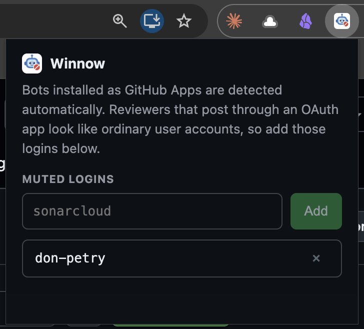
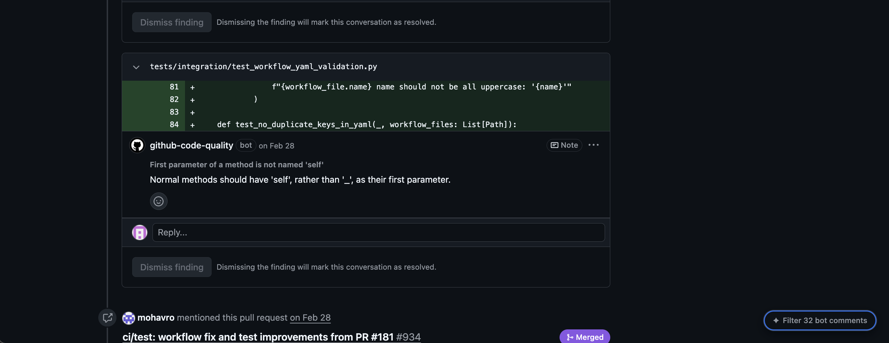
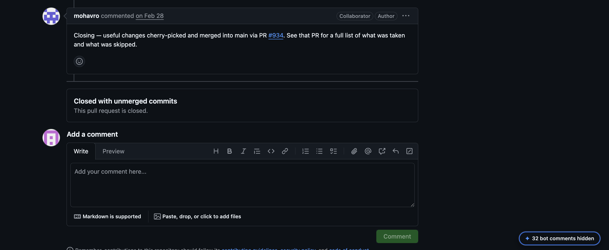

# Winnow

Hides AI review-bot comments on GitHub pull requests so you can read what your
coworkers actually said.

No server, no token, no API calls — it filters the page you're already looking
at.

## Install

1. `chrome://extensions` → turn on **Developer mode**
2. **Load unpacked** → pick this folder
3. Open any PR

A pill in the bottom-right corner shows how many comments are hidden. Click it,
or press <kbd>Alt</kbd>+<kbd>Shift</kbd>+<kbd>B</kbd>, to toggle. The toggle is
shared across every open tab.

## Screenshots

Muted logins, managed from the toolbar popup:

Filter off — a bot comment sits in the timeline like any other:

Filter on — bot comments are hidden and the pill shows the count:

## How it decides what's a bot

GitHub renders an App bot's name as a link to `/apps/<name>` with no user
hovercard, while a person gets `/<login>` plus `data-hovercard-type="user"`.
That's the primary signal, backed up by the `[bot]` login suffix.

Review tools that authenticate through an **OAuth app** post as ordinary user
accounts and carry no marker at all. Name those logins in the extension's
popup (click the toolbar icon).
